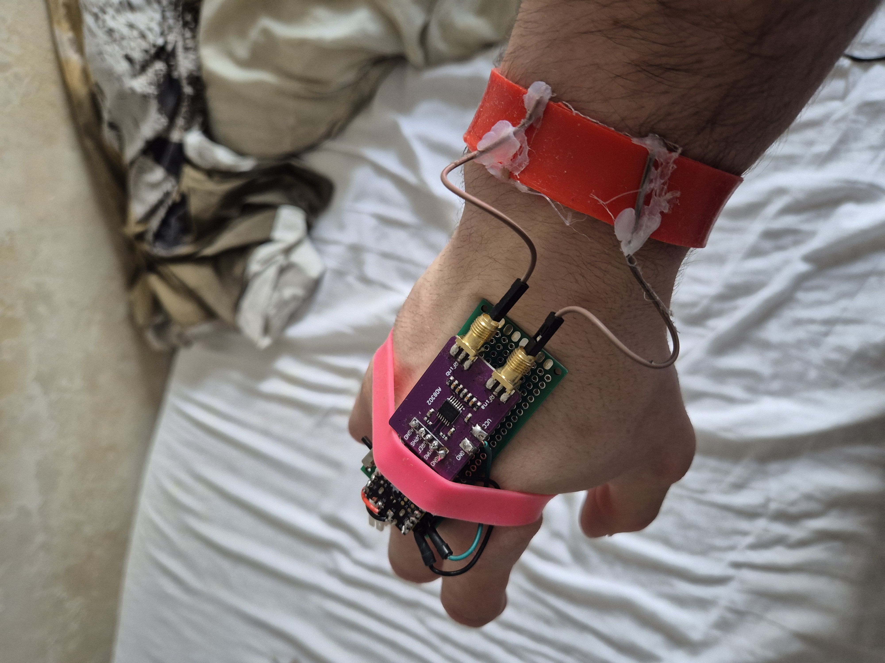

# RAFUI - Radio Frequency User Interface

## Prototype Preview

  

## Description
RAFUI is a user input interface that uses skin as a 2D input surface by reading phase shift and magnitude difference of an RF signal.

The system uses:
- An 80 MHz oscillator emitter on a ring worn on one hand (or integrated into a glove)
- A bracelet/sensor array on the other hand that reads resulting RF signal behavior

The concept was introduced in 2016 by researchers at CMU (SkinTrack). We improved the design and data analysis to make the interface practical not only for everyday users, but also for industrial and blue-collar workers in dirty environments where touchscreens are difficult to use.

## Problem
Industrial and blue-collar workers need to interact with machines in harsh environments. Today, this is usually solved in two ways:

- Expensive high-sensitivity capacitive industrial touchscreens (for example Siemens)
- Crude physical button interfaces

### Limitations of current options
- Capacitive touchscreen sensitivity is problematic with thick gloves.
- Workers often need to remove gloves, creating safety risk and time loss.
- In wet environments, capacitive screens fail, pushing users toward resistive technology.
- Resistive solutions are old-school, less ergonomic, and often require frequent hardware replacement/rework.
- Industrial capacitive touchscreens commonly cost in the 700-1400 EUR range.

## Market Analysis
The industrial HMI and rugged display sector is a massive, highly capitalized market with clear room for disruption.

- As of 2025, the global rugged display market is valued around 11-12 billion USD.
- Projections indicate growth beyond 16 billion USD by 2035.
- Heavy industries (manufacturing, oil and gas, defense) invest heavily in these systems to survive harsh, dirty, and wet operating conditions.

## Competitive Landscape
The market is dominated by automation conglomerates (Siemens, Rockwell Automation) and specialized hardware manufacturers (Advantech, Zebra Technologies, Panasonic). Their prevailing strategy focuses on tougher enclosures and increasingly expensive hardened glass.

## Technological Gap
The market is currently trapped between four flawed options:

### 1. Resistive Touchscreens
- Work with gloves
- Scratch easily and degrade over time
- Lack modern multi-touch capability
- Typical industrial cost: 300-800 USD (extreme models can exceed 1,000 USD)

### 2. Industrial PCAP Screens
- Support modern gestures
- Require over-tuned sensitivity for gloves/thick glass
- Prone to false inputs from water and metallic dust
- Typical cost: 800-1,600+ USD per terminal

### 3. Membrane Switches
- Highly durable
- Static and non-adaptive
- No dynamic UI without physical rewiring
- Typical custom panel cost: 5-50 USD per unit

### 4. Rugged Enterprise Tablets
- Mobile and capable
- Expensive and hand-occupying
- Typical cost: 800-3,000+ USD depending on ruggedness and safety rating

## RAFUI Market Positioning
RAFUI bypasses fragile and expensive glass-centered interaction systems.

- By turning the worker's body or a simple RF pad into the interface, RAFUI can undercut traditional rugged displays by an estimated 40%-60%.
- By reducing PPE friction (no glove removal) and keeping hands available for physical work, RAFUI becomes more than hardware substitution and can evolve into a high-ROI productivity platform for enterprise workflows.

## Solution
RAFUI uses radio frequency to bypass key constraints of glove/wet/dirty operation.

### Core operation
- User wears a ring emitting an 80 MHz signal (or emitter integrated in glove)
- Terminal includes an RF touchpad with phase-shift and magnitude analysis to infer 2D coordinates

### Extended operation
A more elegant variant uses the user's hand directly as the touchpad, making RAFUI more accessible and more affordable for both industrial and consumer applications.

## Product Variants
### Variant 1 (B2B / HMI)
RF-based touchpad + signal-emitting gloves for industrial machine input.

### Variant 2 (B2C)
Skin-as-touchpad interaction for:
- Blue-collar freelancers
- Daily consumers

Use cases include smartphone/smartwatch control during work, and wireless HMI interaction without physical buttons or dedicated touchpads.

## Cost and Pricing Estimate
Compared to current solutions:

- Estimated development cost: around 130 EUR
- Estimated human work: around 40 minutes per unit
- Estimated production cost: around 150 EUR
- Potential commercial price: around 400-500 EUR

This still positions RAFUI at roughly 40% lower cost versus many current industrial alternatives.

## Target Markets and Audience
- Variant 1: B2B (factories, oil rigs, industrial operators)
- Variant 2: B2C
  - Option A: blue-collar freelancers
  - Option B: daily consumers

## Current Stage
The project is currently in development with a working POC.

Current demonstrated capability:
- Detection of 3 calibrated buttons
- Calibration time: approximately 5 minutes
- Current hardware: one AD8302 chip + standard CMOS 80 MHz oscillators

## Link
- CMU Study (SkinTrack): https://yangzhang.dev/research/SkinTrack/SkinTrack.pdf
